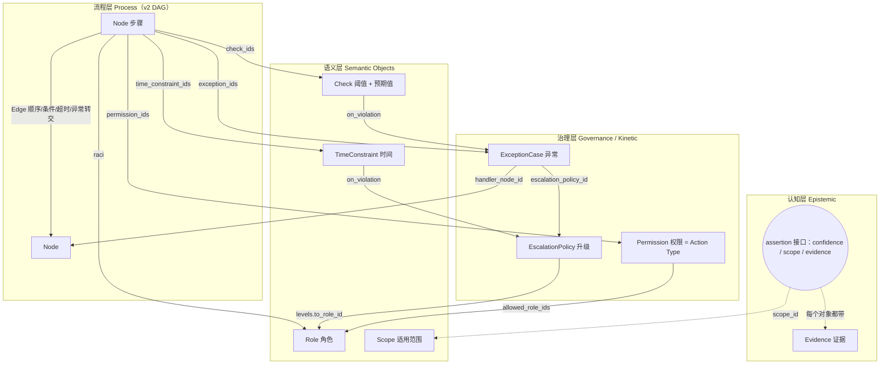

# Manufacturing Operational Ontology（制造运营本体）v1 设计

> 状态：草案 v1（2026-10-07）
> 对应 Schema：[`schema/workflow_graph_schema_v3.json`](../schema/workflow_graph_schema_v3.json)
> 对应代码：`expert-collection/backend/app/ontology.py`（模型 + v2→v3 提升）、`app/ontology_validator.py`（校验规则）

## 0. 目的与范围

现有采集产品线已经能把专家口述的流程抽成 DAG（`workflow_graph_schema_v2.json`，含 #34 合入的 Phase 3-A 字段）。但 DAG 只回答"先做什么、后做什么"，回答不了一个运营系统真正需要的问题：

- 这一步**多长时间**内必须完成？从什么时候开始算？
- 判定"合格"的**阈值**是什么？**预期值**（目标值）又是多少？
- 这条知识的**证据**是什么？执行这一步需要留下什么**证据**？
- 谁执行、谁拍板（**角色**）？谁**有权**放行、绕过、停线？
- 这条知识有多可信（**confidence**）？在哪些产线/产品上成立（**scope**）？
- 出了**异常**走哪条路？多久没人处理就**升级**给谁？

本文定义一个统一的本体，把这 10 个维度变成**一等的、可引用、可校验**的结构，而不是散落在自由文本里。范围限定为"专家流程知识的结构化表达"，不涉及 MES/ERP 实时数据接入（那是后续阶段）。

## 1. 设计原则（借鉴 Palantir Foundry Ontology）

Palantir Foundry 的本体把世界分成几类构件（定义均引自其公开文档）：

| Palantir 概念 | 官方定义 | 本体中的对应 |
|---|---|---|
| Object Type | "the schema definition of a real-world entity or event" [1] | Role、Check、ExceptionCase 等对象类型 |
| Link Type | "the schema definition of a relationship between two object types" [1] | 节点/边通过 `*_id(s)` 引用对象，不内嵌复制 |
| Action Type | "the schema definition of a set of changes or edits to objects, property values, and links" [1] | Permission：谁能对某一步执行"批准/放行/绕过/停线"等动作 |
| Submission criteria | "the conditions that determine whether an action can be submitted"，可基于当前用户（如所属组）和参数对象状态 [2] | Permission.submission_criteria |
| Interface | "describes the shape of an object type and its capabilities" [1] | `assertion` 元数据：所有对象共享的 confidence / scope / evidence 形状 |
| Functions | 接收参数、处理对象集并返回结果的代码逻辑 [1] | 本版不做；Check 的 `aggregation` 预留了计算语义 |

我们据此采用四条原则：

1. **语义层与动作层分离**。"是什么"（Role、Check、Scope）和"谁能改变状态"（Permission）分开建模。Palantir 把 Action Type 作为唯一受控的写入通道，并以 submission criteria 约束提交 [2]；对应到制造现场，"放行""绕过温度检测""停线"这类动作必须显式声明谁能做、在什么条件下能做。
2. **对象用 id 链接，不内嵌复制**。同一个"质量工程师"角色、同一条"CPK ≥ 1.33"判据会被多个节点引用。注册一次、到处引用，才能做一致性校验和跨流程复用。
3. **共享形状用接口表达**。confidence、scope、evidence 不是某一类对象独有的属性，而是"每一条知识断言"都该带的元数据，因此定义为一个所有对象都实现的 `assertion` 接口。
4. **向后兼容、增量提升**。v2 的字段一个不删；v3 在记录上新增 `ontology` 注册表，并提供确定性的 v2→v3 提升函数，已有数据可以直接投影成本体视图。

## 2. 分层总览



## 3. 十个维度的定义与落点

每个维度给出：定义、落在哪个对象、与 v2/#34 已有字段的关系、采集时该怎么追问。

### 3.1 时间（TimeConstraint）

- **定义**：对一个步骤或一段流程的时间约束。统一用 ISO 8601 时长（如 `PT4H`、`P3D`）并显式声明**起算锚点**。
- **类型** `kind`：`expected_duration`（通常耗时）、`deadline`（硬截止）、`target`（目标）、`warn_threshold`（预警线）、`validity_window`（有效期）、`waiting_period`（必须等待，如固化 24 小时）、`frequency`（周期，如每班一次）。
- **锚点** `anchor`：`previous_node_completed`、`node_started`、`workflow_start`、`event_occurred`、`manual_start`。
- **违约处理** `on_violation`：`escalate` / `notify` / `auto_reassign` / `none`，`escalate` 时引用一个 EscalationPolicy。
- **v2 关系**：`node.sla_config` 与 `node.expected_duration` 都提升为 TimeConstraint；`timeout` 类型的边通过 `time_constraint_id` 指向它。
- **追问**："这一步一般多久能做完？最晚不能超过多久？从什么时候开始算？超时了会怎样？"

### 3.2 阈值（Check.limits）

- **定义**：把测量值划分成等级的**判定边界**，回答"到哪就不行了"。
- **结构**：`limits` 是一组带等级的区间 `{band, lower, upper, lower_inclusive, upper_inclusive}`，`band ∈ normal / warning / critical / reject`。数值应当带 `unit`（无量纲指标写 `index`），缺失时校验给出警告。
- 对时间序列判断，沿用 #34 的 `aggregation`（`window_size`、`operator`、`min_samples`），例如"过去 10 个点标准差 < 2°C"。
- **v2 关系**：#34 的 `evaluation_criteria[].thresholds` 是 `{normal, warning, critical}` 三个自由字符串。v3 提升时保留原文到 `limits_text`，能解析出数字区间的再结构化（如 `"15-35"`、`">= 1.33"`）。

### 3.3 预期值（Check.expected）

- **定义**：正常情况下**应当**得到的值或结果，回答"本来应该是多少"。它和阈值是两件事：目标值 25°C、公差 ±10°C 是预期值；超过 35°C 报警、超过 40°C 停机是阈值。
- **结构**：`expected = {target, tolerance_minus, tolerance_plus, value, description}`。数值型用 `target` + 公差，分类型用 `value`（如"首件检验结论 = 合格"）。
- **一致性**：预期值必须落在 `normal` 区间内，否则校验报警（`ont_expected_outside_normal`）。
- **追问**："正常情况下这个值应该是多少？允许偏多少？到多少开始担心？到多少必须停？"

### 3.4 证据（Evidence 与 EvidenceRequirement）

证据有两种完全不同的含义，本体把它们分开：

| | 溯源证据 Evidence | 作业证据 EvidenceRequirement |
|---|---|---|
| 回答 | 我们**凭什么相信**这条知识？ | 执行这一步**必须留下**什么？ |
| 例子 | 专家原话、SOP 条款、历史记录 | 首件检验报告、签字记录、校准证书 |
| 落点 | 注册表 `ontology.evidence[]`，由 `assertion.evidence_ids` 引用 | `node.required_evidence[]`、`permission.required_evidence[]` |

- Evidence 的 `kind`：`expert_quote`、`document`、`system_record`、`measurement`、`observation`、`standard`。
- **v2 关系**：main 上 `Node.evidence: list[str]`（专家原话摘录）提升为 `kind=expert_quote` 的 Evidence，并带上 `turn_id`。

### 3.5 角色（Role）

- **定义**：组织中承担职责的岗位，不是具体的人（具体人是 v2 `entity_type=person`，可以通过 `entity_ids` 关联）。
- **结构**：`{role_id, name, aliases, level, reports_to, qualifications}`。`reports_to` 构成汇报链，是升级路径的默认来源。
- **节点上的角色**用 RACI 表达：`raci = {responsible, accountable, consulted, informed}`，都是 role_id 列表。
- **v2 关系**：`node.actor_roles`（字符串）提升为 Role，并进入 `raci.responsible`；`approval_matrix[].required_roles` 进入 Permission 的 `allowed_role_ids`。

### 3.6 权限（Permission，对应 Palantir Action Type）

- **定义**：谁可以对某个步骤执行某个**受控动作**，以及在什么条件下可以。
- **动作** `action`：`execute`、`approve`、`reject`、`release`、`bypass`、`waive`、`stop_line`、`modify_parameter`、`sign_off`。
- **结构**：
  - `allowed_role_ids`：哪些角色可以做；`sequence`：`sequential` / `parallel` / `any_one`
  - `submission_criteria`：提交条件，`kind ∈ actor / parameter / object_state`，直接对应 Palantir submission criteria 的"当前用户条件"与"参数条件" [2]。例如"金额 > 5 万时须财务审批"、"操作者须持有 X 资质"
  - `separation_of_duties`：为 true 时执行者不能自己批准自己
  - `required_evidence`：执行该动作必须附带的作业证据
  - `failure_message`：不满足条件时给用户看的原因（Palantir 同样要求为被拦截的提交给出失败原因 [2]）
- **v2 关系**：每条 `approval_matrix` 提升为一条 `action=approve` 的 Permission；`criteria` 进入 `submission_criteria`；`escalation_level` 进入关联的 EscalationPolicy。

### 3.7 confidence（assertion.confidence）

- **定义**：这条**知识断言**有多可信，0–1。注意区分：v2 `judgement.confidence` 是专家对现场判断的把握，属于知识内容；`assertion.confidence` 是我们对"这条结构化知识是否正确"的把握，属于元数据。
- **必须同时给出依据** `confidence_basis`：`expert_stated`、`expert_confirmed`、`multi_expert_agreement`、`document_backed`、`data_verified`、`llm_inferred`。只有一个数字而不知道来源，下游无法使用。
- **校验**：confidence < 0.6 且没有任何证据时警告；`llm_inferred` 且专家未确认时警告。

### 3.8 scope（Scope，适用范围）

- **定义**：一条知识**在哪里成立**。用选择器描述：`manufacturing_mode`、`industry`、`site_type`、`process_area`、`product_family`、`line_ids`、`equipment_ids`、`material_ids`、`shift_context`，再加上自由文本 `conditions` 和 `exclusions`。
- **默认值**：未声明 `scope_id` 的断言继承记录级 `manufacturing_context` 生成的默认 Scope。
- **与隔离范围的区别**：#34 的 `containment_scope`（按设备/批次/物料隔离产品）回答的是"出了问题**影响**到哪"，属于异常处置，在 v3 中归入 `ExceptionCase.containment`；`Scope` 回答的是"这条规则**适用**于哪"。两者名字相近，本体里刻意分开。

### 3.9 exception（ExceptionCase）

- **定义**：偏离正常路径的一类情况，以及它的处置方式。
- **结构**：
  - `trigger`：`check_violation`（引用 check_id）、`timeout`（引用 time_constraint_id）、`event`、`rejection`、`repeat_occurrence`
  - `severity`：`minor` / `major` / `critical`
  - `handler_node_id`：异常转交到哪个步骤，对应 DAG 上的 `exception_forward` 边
  - `containment`：沿用 #34 `containment_scope` 的形状
  - `temporary_measure`：临时措施（bypass、降速运行、临时作业许可），沿用 #34 的 `expiration` / `revocation_trigger`，并可引用一条 `action=bypass` 的 Permission 说明谁能批准临时措施
  - `escalation_policy_id`、`resolution_criteria`
- **v2 关系**：`retry_semantics.is_temporary` 及其 `expiration`、`revocation_trigger` 提升为 `temporary_measure`；节点/边上的 `containment_scope` 提升为 `containment`。

### 3.10 escalation（EscalationPolicy）

- **定义**：没人处理、处理不了或反复发生时，把问题**逐级上交**的规则。
- **结构**：
  - `trigger`：`timeout`、`severity`、`repeat`（带 `repeat_count`、`within_duration`）、`rejection`、`manual`
  - `levels`：有序数组 `{level, to_role_id, after, action}`，`after` 是距上一级的 ISO 8601 时长，`action ∈ notify / reassign / approval_required / stop_production / create_capa`
  - `terminal_action`：最后一级之后的兜底动作
- **v2 关系**：#34 中升级信息分散在三处（`sla_config.violation_action=escalate`、`approval_matrix[].escalation_level`、`retry_semantics.escalation_on_repeat`），v3 统一成 EscalationPolicy。

## 4. 横切元数据：assertion 接口

所有本体对象（以及 v3 下的节点和边）都可以带 `assertion`：

```json
{
  "confidence": 0.85,
  "confidence_basis": "expert_stated",
  "evidence_ids": ["ev_001"],
  "scope_id": "scope_default",
  "expert_confirmed": true,
  "source_turn_ids": ["t3"],
  "valid_from": "2026-01-01",
  "valid_until": null
}
```

`valid_from` / `valid_until` 是知识本身的时效（例如某条临时规定只在今年有效），不同于 TimeConstraint 描述的作业时间。

## 5. 四组容易混淆的概念

| 容易混在一起的 | 区别 | 本体落点 |
|---|---|---|
| 阈值 vs 预期值 | 判定边界 vs 正常应得值 | `Check.limits` vs `Check.expected` |
| 溯源证据 vs 作业证据 | 凭什么相信 vs 必须留下什么 | `Evidence` vs `EvidenceRequirement` |
| 适用范围 vs 隔离范围 | 规则在哪成立 vs 问题影响到哪 | `Scope` vs `ExceptionCase.containment` |
| 异常 vs 升级 | 发生了什么、怎么处置 vs 处置不了交给谁 | `ExceptionCase` vs `EscalationPolicy` |

## 6. v2 → v3 字段映射

提升函数 `ontology.lift_v2_record()` 是确定性的（同样输入得到同样输出），不调用 LLM。

| v2 / #34 字段 | v3 去向 |
|---|---|
| `manufacturing_context` | 默认 `Scope`（`scope_default`） |
| `node.actor_roles[]` | `Role` + `node_links.raci.responsible` |
| `node.evaluation_criteria[]` | `Check`（`source_criterion_id` 保留原 id，`limits_text` 保留原文；采集追问写入的 `limits` / `expected` 直接沿用，原话 `description` 变成 Evidence） |
| `node.sla_config` | `TimeConstraint`（kind 取 sla_config.type）；`escalate_to_role` 填入升级策略第 1 级 |
| 审批节点的 `actor_roles`（无 `approval_matrix` 时） | `Permission`（action=approve） |
| `node.expected_duration` | `TimeConstraint`（kind=expected_duration） |
| `node.approval_matrix[]` | `Permission`（action=approve）；有 `escalation_level` 时生成 `EscalationPolicy` |
| `node.retry_semantics`（is_temporary 等） | `ExceptionCase.temporary_measure`；`escalation_on_repeat` 生成 `EscalationPolicy` |
| `node/edge.containment_scope` | `ExceptionCase.containment` |
| `node.evidence[]`（专家原话） | `Evidence`（kind=expert_quote） |
| `node/edge.confidence`、`expert_confirmed`、`source_turn_ids` | `assertion` |
| `edge(edge_type=timeout)` | 关联到起点节点的 TimeConstraint |
| `edge(edge_type=exception_forward)` | `ExceptionCase.handler_node_id` = 边终点 |

## 7. 校验规则

规则在 `app/ontology_validator.py` 实现，输出沿用现有 `ValidationIssue` 格式（`level`、`code`、`message`、`node_id`）。本版**不接入**确认门禁（不阻止专家确认），只通过 `GET /api/expert-workflows/{id}/ontology` 暴露，避免改变现有采集流程的行为。

| code | 级别 | 规则 |
|---|---|---|
| `ont_dangling_ref` | error | 任何 `*_id` 引用在注册表里找不到 |
| `ont_duplicate_id` | error | 同一注册表内 id 重复 |
| `ont_bad_duration` | error | 时长不是合法 ISO 8601 |
| `ont_check_missing_unit` | warning | 数值型 Check 有数值但没有单位（无量纲指标如 CPK 也应显式写 `index`） |
| `ont_limit_inverted` | error | 区间下限大于上限 |
| `ont_expected_outside_normal` | warning | 预期值不在 normal 区间内 |
| `ont_check_empty` | warning | Check 既没有预期值也没有阈值 |
| `ont_temp_measure_no_expiry` | error | 临时措施没有有效期也没有失效条件 |
| `ont_permission_no_roles` | error | Permission 没有任何可执行角色 |
| `ont_sod_violation` | error | 要求职责分离，但批准角色同时是被批准工作（直接前序 `activity` 节点）的执行者 |
| `ont_approval_without_permission` | warning | `approval` 节点没有关联 Permission |
| `ont_escalation_no_levels` | error | EscalationPolicy 没有任何层级 |
| `ont_escalation_level_order` | error | 层级号不是严格递增 |
| `ont_escalation_missing_role` | warning | 某一级没有指定升级给哪个角色（v2 数据提升后常见，需专家补充） |
| `ont_time_missing_duration` | warning | 时间约束没有给出时长 |
| `ont_exception_unhandled` | warning | 异常既没有处置节点也没有升级策略 |
| `ont_decision_without_check` | warning | 决策节点有条件分支，但没有任何可量化 Check |
| `ont_low_confidence_no_evidence` | warning | confidence < 0.6 且没有证据 |
| `ont_inferred_unconfirmed` | warning | 注册表对象为 `llm_inferred` 且专家未确认（节点本来就由模型抽取、最后统一确认，所以不对节点报） |

## 8. 示例：发布审批流程（节选）

完整样例见 [`schema/workflow_graph_v3_sample.json`](../schema/workflow_graph_v3_sample.json)。它基于 `PHASE3A_REAL_WORKFLOW_SAMPLES.md` 的样本 1。**注意：该样本是先前会话整理撰写的合成样例，不是专家口述原文**；拿到专家原话后应替换，并把 `confidence_basis` 改为 `expert_stated`。

节选（质量放行这一步）：

```json
{
  "node_id": "n_quality_release",
  "node_type": "approval",
  "label": "质量放行",
  "raci": { "responsible": ["role_qe"], "accountable": ["role_quality_mgr"] },
  "check_ids": ["chk_cpk", "chk_first_article"],
  "permission_ids": ["perm_quality_release"],
  "time_constraint_ids": ["tc_quality_release_deadline"],
  "required_evidence": [
    { "artifact_type": "inspection_result", "description": "首件检验报告", "mandatory": true }
  ]
}
```

对应 Check：

```json
{
  "check_id": "chk_cpk",
  "name": "过程能力指数 CPK",
  "kind": "numeric",
  "unit": "index",
  "expected": { "target": 1.67 },
  "limits": [
    { "band": "normal", "lower": 1.33 },
    { "band": "warning", "lower": 1.0, "upper": 1.33, "upper_inclusive": false },
    { "band": "reject", "upper": 1.0, "upper_inclusive": false }
  ],
  "on_violation_exception_id": "exc_cpk_low"
}
```

## 9. 采集追问与界面展示（第 4 步）

### 9.1 追问放在哪

专家录入的主流程是**先叙述、后澄清**（IMPLEMENTATION_PLAN 第 17 节，`app/review_agent.py`）：专家先完整讲一遍，系统据此生成 DAG 初稿，再由 LLM 从待澄清清单（`app/review_gaps.py`）里逐项挑问题问专家。本体追问就作为这份清单里的两类条目加入，不另起流程：

| 清单条目 | 触发条件 | 问法 | 写入 |
|---|---|---|---|
| `criterion`：判断标准（阈值 + 预期值） | 初稿里有判断（decision）步骤，且该步骤还没有 `evaluation_criteria` | 「X」这里判断走哪条路时，有具体的标准吗？比如正常应该是多少、到多少就不行？ | 判断节点的 `evaluation_criteria[]`：`limits`、`expected`、`unit`、原话 `description` |
| `timing`：时限 + 超时升级 | 初稿里有审批（approval）步骤，且该步骤还没有 `sla_config` | 「X」要等人确认，一般最晚多久要有结果？超时了会找谁？ | 审批节点的 `sla_config`：`duration`（ISO 8601）、原话 `description`；回答里说了「找/报给/通知某人」时再写 `violation_action=escalate` + `escalate_to_role` |

- **优先级**：排在结构问题（未核实步骤、校验错误、判断条件）之后，模型自己提出的疑问之前（`PRIORITY` 中 criterion=35、timing=36）。用真实模型试跑时，专家几乎每回答一句，模型都会再提一个新疑问（优先级 40），排在它后面的问题在 `max_questions` 用完前一直轮不到。同一次试跑里，模型挑下一个问题时也总是挑自己的新疑问，所以当清单里排第一的是这两类问题时，由代码直接选它，模型只负责措辞。
- **数量**：每类最多问前 2 个步骤，整轮仍受 `max_questions` 上限约束，避免拖长访谈。
- **谁来写字段**：LLM 只负责判断专家这句话是不是在回答刚才的问题（`intent=answer`，或把该条目列进 `resolved_gap_ids`）；写进节点的内容由代码用 `ontology_capture.criterion_from_answer` / `sla_from_answer` 从专家原话解析，LLM 的改图操作（`sanitize_ops` 白名单）不能直接写这些字段。专家反问或说别的事（`intent=other`）时什么也不写。
- **只问一次**：专家答「没有具体数值，靠经验看」「没有明确的时间要求」时不写字段，但该条目已标记为已问/已解决，不会再问。
- **最后的复述**：确认前的整图复述会带上记下的判断标准和时限原话，专家确认的就是将要保存的内容。
- 只有在审阅别人的图（annotate / arbitrate）时不问这两类，与其他覆盖性问题一致。

没有配置 LLM 时，系统退回逐步引导（`app/guide_service.py`），同样的两类追问以扫查（sweep）形式出现：分情况 → 同时进行 → 等人确认 → 返工 → **判断标准 → 时限/升级** → 经验，答案用同一套解析函数处理。

### 9.2 只记专家说过的数

`app/ontology_capture.py` 用规则解析回答：只有回答里**字面出现**的数字才会变成结构化的区间、预期值或时长，例如「15 到 35 度，正常 25 度，超过 40 度就得停」解析成 normal 15–35、reject >40、预期 25。解析不出来的回答（「主要看铁屑颜色」「一个班之内」）只保留原话，不补数字；按班次说的时间不会换算成小时，因为各厂班次长度不同。「没超过 0.05mm 就行」虽然以「没」开头，但带了数字，算作回答而不是拒答。

原话会在本体视图里变成 `kind=expert_quote` 的 Evidence，所以这些 Check / TimeConstraint 的 `confidence_basis` 是 `expert_stated`。审批节点上的执行人（`actor_roles`）也会被提升为一条 `action=approve` 的 Permission。

### 9.3 界面

DAG 节点标签下方会显示一行小标签，例如判断节点显示「正常 0.02–0.05mm」，审批节点显示「时限 4小时」「超时找车间主任」。鼠标悬停时，提示框里显示专家的原话。

## 10. 词汇表与本体条目的累积（只累计，不回归）

Grant 2026-10-07 定的方针：**只累计，不回归**。词汇表和本体条目随专家录入、标注持续增长，但**不改录入流程、不回写已有记录、不动 schema 规范**。将来再根据积累下来的词汇表做整理。

### 10.1 两层内容

| 层 | 内容 | 判重方式 |
|---|---|---|
| `term`（词汇） | 专家和标注人实际用过的说法：角色、步骤名、判断问题、分支条件、检查项、单位 | 原样记录，不做同义词合并（合并是后续人工整理的事） |
| `ontology`（本体条目） | 从流程图整理出的结构化对象：Role、Check、TimeConstraint、Permission、ExceptionCase、EscalationPolicy | 去掉每条流程各自的 id 和出处后，内容完全相同的算同一条 |

每条记录出现过的来源（哪条流程、哪次标注）、来源数量、出现在哪些步骤上、首次和最近出现时间。

### 10.2 什么时候累积

- **专家确认提交**流程时（`POST /{id}/confirm`，以及对话里说「确认」）。草稿不计入。
- **标注保存**时：标注人采纳（算当前图）或修正（算修正后的图）。丢弃的不计入；选了「需要修改」但没给出修正图的也不计入。
- 管理员可以对上线前已有的记录做一次性补录。

重复累积同一个来源只更新「最近出现时间」，不会重复计数，所以重复确认或重复补录都是安全的。累积只增不减：流程改了名，旧说法仍留在词汇表里。累积失败只记日志，不会影响保存本身。

### 10.3 谁能看

数据分析员（研究员）和管理员在「词汇表」页查看，只读；补录按钮只有管理员可见，并记入审计日志。

实现在 `app/vocabulary.py`、`app/routers/vocabulary.py`，存在 `accumulated_entries` 表（按 层 + 类别 + 键 唯一）。

## 11. 后续可做

- **ISA-95 对齐**：Role、Equipment、Material 与 ISA-95 的人员/设备/物料模型做映射，便于对接 MES。
- **多专家冲突**：同一断言多位专家给出不同阈值时，如何合并、如何提升 `multi_expert_agreement`。
- **Functions**：把 `aggregation` 变成可执行的计算逻辑，对接实时数据。

## 参考

1. Palantir Foundry 文档，Ontology core concepts：<https://www.palantir.com/docs/foundry/ontology/core-concepts/>（Object Type、Link Type、Action Type、Interface、Functions 的定义均引自此页，2026-10-07 访问）
2. Palantir Foundry 文档，Action types — Submission criteria：<https://www.palantir.com/docs/foundry/action-types/submission-criteria/>（2026-10-07 访问）
3. ISO 8601 时长表示法（`PnYnMnDTnHnMnS`），本文所有时长字段采用此格式。
4. 本仓库：`docs/expert-workflow-collection/schema/workflow_graph_schema_v2.json`、`PRD-SCHEMA-EXTENSION.md`、`PHASE3A_REAL_WORKFLOW_SAMPLES.md`（#34）。
